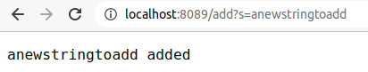
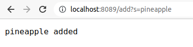
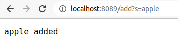
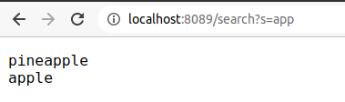
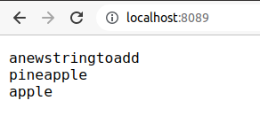
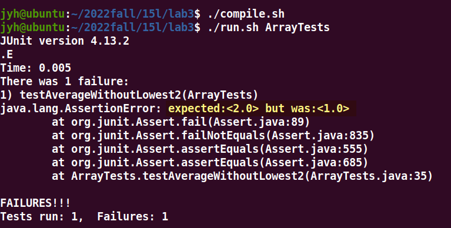
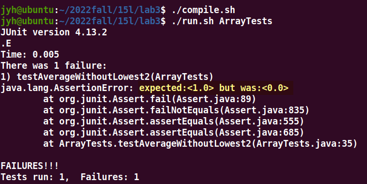
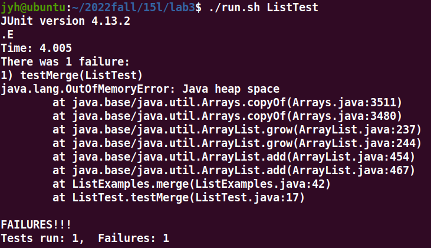
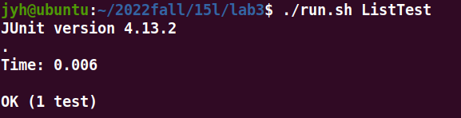

# Lab 2: Simplest Search Engine

## 1. URLHandler
A complete request address includes:  
[`Protocol`]://[`Domain`][`Path`][`Query`]  
In this example, we want to implement two functions: `add` and `search`. These two functions are distinguished by `Path`, and `Query` contains specific parameters, that is, the value to be added or queried.  

```java
class Handler implements URLHandler {
	public String handleRequest(URI url) {
    }
}

class SearchEngine {
	public static void main(String[] args) throws IOException {
		int port = Integer.parseInt(args[0]);
 		Server.start(port, new Handler());
	}
}
```

The handleRequest method is called for every request, the parameter `url` contains some information of the request, `getPath()` is a method of the URI class, which is used to query the `Path` of the request address.  

## 2. add
  
  
  

```java
else if (url.getPath().contains("/add")) {
	String[] params = url.getQuery().split("=");
	s.add(params[1]);
	return params[1] + " added";
}
```
The following methods are used in this code:  
`URI.getPath()`: Returns the Path in the URI, the return value is String  
`URI.getQuery()`: Returns the Query in the URI, the return value is String  
`String.split(String regex)`: Use regex as the separator, divide the string into several strings, and the return value is String[]  

In above code, it is judged whether the request is to add a new value according to whether the `Path` contains `add` or not.  
In fact, this is not a very strict way, because if the request path is `addminus`, `addqwer`, `aaaddd`, it is considered to be the same function.  

If the `Query` is [A]?[B] , the `split()` method returns A and B to the array, that is, `param[0]=A`, `param[1]=B` Add the string to the right of the equal sign to the database.  
This is also not very strict, because a request can have many parameters. For example, the code will incorrectly determine the following address: `/search?id=0&add=apple`  

But this is the simplest implementation.

## 3. root and search
The root and search is similar to the implementation of directory and add.  
  
  

## 4. "database"
The database here uses quotation marks because the data is not stored in IO, but in memory. Every restart of the server will result in the loss of all data.  

The code uses an ArrayList to hold all the added values, performing different operations depending on the function.

## 5. complete code
```java
import java.io.IOException;
import java.net.URI;
import java.util.*;

class Handler implements URLHandler {
	List<String> s = new ArrayList<String>();
	public String handleRequest(URI url) {
		if (url.getPath().equals("/")) {
			String rtn = "";
			for (int i = 0; i < s.size(); ++i) {
				rtn = rtn + s.get(i) + "\n";
			}
			return rtn;
		}
		else if (url.getPath().contains("/add")) {
			String[] params = url.getQuery().split("=");
			s.add(params[1]);
			return params[1] + " added";
		}
		else if (url.getPath().contains("/search")) {
			String[] params = url.getQuery().split("=");
			String rtn = "";
			for (int i = 0; i < s.size(); ++i) {
				if (s.get(i).contains(params[1])) {
					rtn = rtn + s.get(i) + "\n";
				}
			}
			return rtn;
		}
		else {
			return "404";
		}
	}
}

class SearchEngine {
	public static void main(String[] args) throws IOException {
		int port = Integer.parseInt(args[0]);
 		Server.start(port, new Handler());
	}
}
```


# Lab 3: Simplest Search Engine

##  average with out "lowest"
```java
static double averageWithoutLowest(double[] arr) {
    if (arr.length < 2) {
        return 0.0;
    }
    double lowest = arr[0];
        for (double num: arr) {
        if (num < lowest) {
            lowest = num;
        }
    }
    double sum = 0;
    for (double num: arr) {
        if (num != lowest) {
            sum += num;
        }
    }
    return sum / (arr.length - 1);
}
```
The reason I chose this method is that this bug is harder to detect than the other two methods in this file.  
Probably, many test data will pass, for example, when the input is `[1.0, 2.0, 3.0]`, the expected output is `2.5`, and the actual output is also `2.5`.

But when testing the following data, the expected output and actual output are inconsistent.  
```java
@Test
public void testAverageWithoutLowest2() {
    double[] input1 = {3.0, 1.5, 1.5, 1.5};
    assertEquals(2.0, ArrayExamples.averageWithoutLowest(input1), 1e-9);
}
```
  

Do more tests...
```java
@Test
public void testAverageWithoutLowest2() {
    double[] input1 = {1.0, 1.0, 1.0};
    assertEquals(1.0, ArrayExamples.averageWithoutLowest(input1), 1e-9);
}
```
  
It will be found that when there are repeated numbers in the test data, the test will fail. The reason is that in the process of removing the smallest number, the program removes all the smallest values. When calculating the mean, the denominator is n-1, ie it is assumed that only one minimum value has been removed.

To fix this bug, we need to modify the process of removing the minimum value. A simple implementation is to accumulate all numbers and finally subtract the minimum value:  

```java
static double averageWithoutLowestNew(double[] arr) {
    if(arr.length < 2) { return 0.0; }
    double lowest = arr[0];
    for(double num: arr) {
        if(num < lowest) { lowest = num; }
    }
    double sum = 0;
    for(double num: arr) {
        sum += num;
    }
    sum -= lowest;
    return sum / (arr.length - 1);
}
```

## stack over flow
```java
  static List<String> merge(List<String> list1, List<String> list2) {
    List<String> result = new ArrayList<>();
    int index1 = 0, index2 = 0;
    while(index1 < list1.size() && index2 < list2.size()) {
      if(list1.get(index1).compareTo(list2.get(index2)) < 0) {
        result.add(list1.get(index1));
        index1 += 1;
      }
      else {
        result.add(list2.get(index2));
        index2 += 1;
      }
    }
    while(index1 < list1.size()) {
      result.add(list1.get(index1));
      index1 += 1;
    }
    while(index2 < list2.size()) {
      result.add(list2.get(index2));
      index1 += 1;
    }
    return result;
  }
```
This is a method similar to the step of merge sort, which looks fine at first glance, but a run time error will appear when running unit tests.  
```java
@Test
public void testMerge() {
    List<String> input1 = Arrays.asList(new String[]{"a", "c", "e"});
    List<String> input2 = Arrays.asList(new String[]{"b", "d", "f"});
    List<String> output = ListExamples.merge(input1, input2);
    List<String> exp = Arrays.asList(new String[]{"a", "b", "c", "d", "e", "f"});
    assertThat(output, is(exp));
}
```
  
This is a very small test data, there should not be an error of insufficient heap space, it is likely to be an infinite loop.  
By checking, in the last while loop, the loop variable index2 is not changed, but the value of index1 is changed by mistake.

Change index1 to index2 program to pass the test:  

  

This is a very simple bug, and the reason I chose this example is that it's a little more challenging to unit test Objects.  
Comparing the length and corresponding value of two Lists is a method, and using org.hamcrest.CoreMatchers.is is also a good choice.