# Lab 3: grep

## 1. Introduction
`grep` is one of the most used and important commands in Linux, When I google "linux find content in files recursively", the top result is `grep -r 'something' /path/to/dir`; when I google "linux find process running on 80", the top result The result is `netstat -tulpn | grep :80`.

This not only shows the importance of the grep command, but also means that `grep`, unlike find, is not just a command for files, but for content.

`grep` finds all matches in the input:

`grep [OPTION...] PATTERNS [FILE...]`

## 2. Input
`FILE` here is optional, according to the `grep` manual, another input method is standard input:

>A  FILE  of  “-”  stands  for  standard  input.   If  no FILE is given, recursive searches examine the working directory, and nonrecursive searches read standard input.

### (a). file
If the input is file(s), `grep` looks for matching patterns in those files:

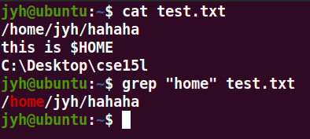  

The bash extension also works:

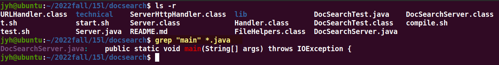

But in non-recursive mode, `grep`'s file cannot be a directory:

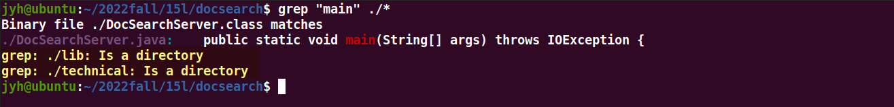

### (b). standard input
There are many methods of standard input, using the keyboard to simulate input in the terminal, redirect, or pipe.

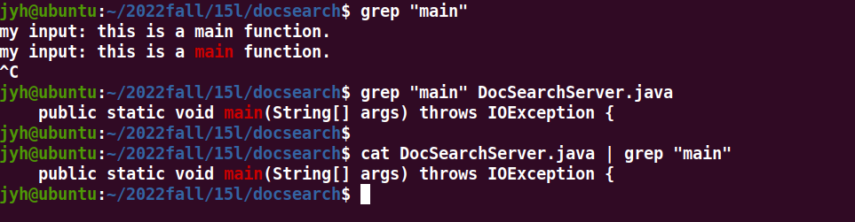

### (c). priority
>A  FILE  of  “-”  stands  for  standard  input.   If  no FILE is given, recursive searches examine the working directory, and nonrecursive searches read standard input.

If neither a file nor standard input is specified, in recursive mode `grep` assumes that the directory is the current directory; in non-recursive mode, `grep` will read your simulated standard input in the terminal.

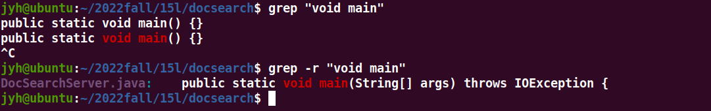

If both file and standard input are specified, `grep` ignores standard input:

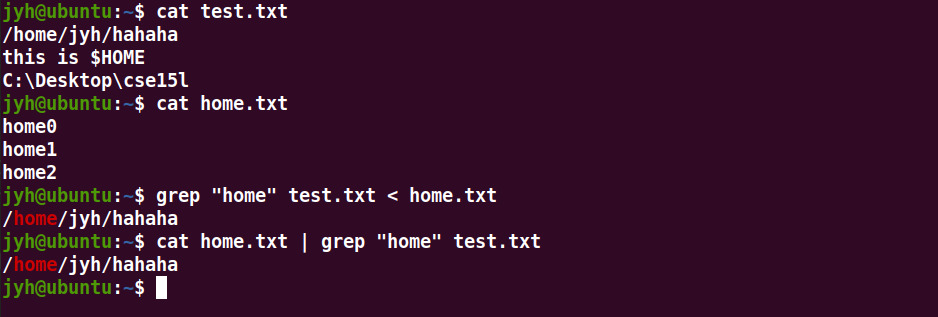

## 3. pattern
### (a). no quotation marks
If there are commands, variables in the pattern, the variables and commands will be parsed first, if there are special characters such as spaces in the string, the output will not be complete.

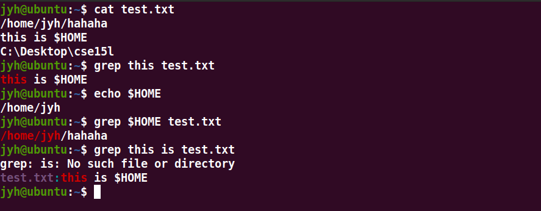

### (b). single quotes
The pattern within the single quotes will be output as it is (except for some special characters), will not be replaced whether it is a constant or a variable. Some special characters still require backslashes like `\-`, `\\`.

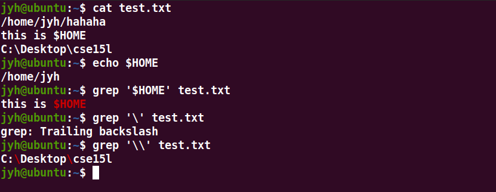

### (c). double quotes
The behavior of double quotes is similar to that of unquoted, except that there can be characters such as spaces inside, but if you want to match `\`(a backslash), there will be a strange phenomenon.

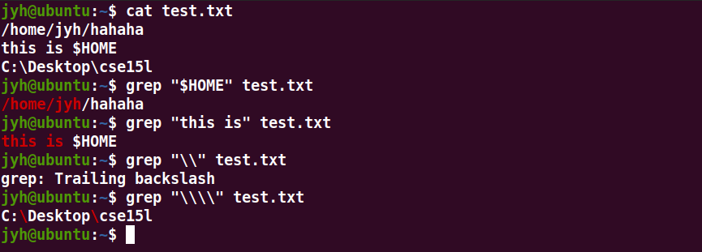

Matching `\` in double quotes requires 4 backslashes. The reason is that the content in the double quotes will be escaped by bash, and bash will first escape the four `\` into two and give it to `grep`, and then `grep` will escape the two into one.

## 3. option
### (a). --color
>--color[=WHEN], --colour[=WHEN]  
>Surround the matched (non-empty) strings, matching lines, context lines, file names, line numbers, byte offsets, and separators (for fields and groups of context lines) with escape sequences to display  them in  color  on  the  terminal.   The  colors  are  defined by the environment variable GREP_COLORS.  The deprecated environment variable GREP_COLOR is still supported, but its setting does not have  priority .WHEN is never, always, or auto.  

`--color` has three options, `always`, `auto` and `never`.

`--color=always`

When the option is `always`, `grep` will always add color marks to the matching fields, whether they are terminal output, redirects or pipes.

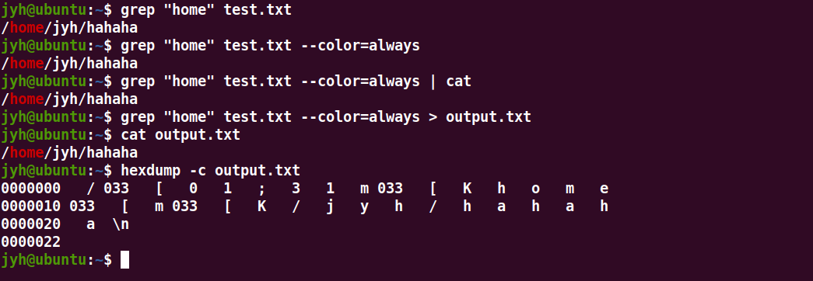

This can sometimes cause problems, such as redirecting results to a file with incomprehensible color markings within the file.

`--color=never`

If the option is never, grep will never color match fields.

`--color=auto`

If the option is `auto`, this is a bit vague because the manual doesn't say anything about `auto`'s behavior.

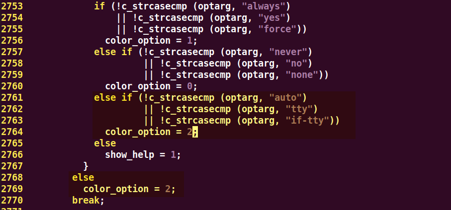

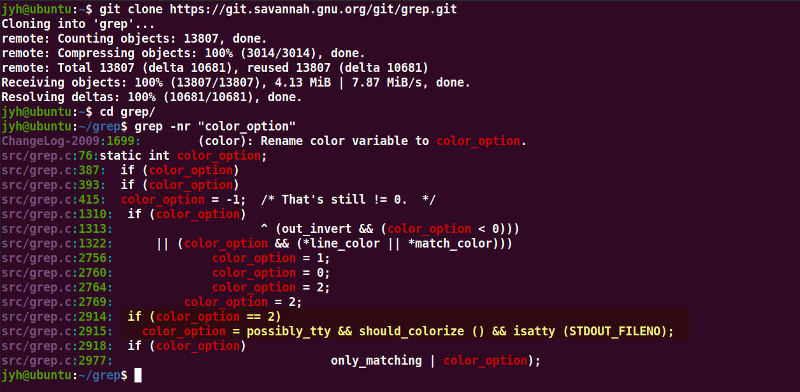

In grep 3.8 (2022-09-02 stable), the prerequisite for coloring is that the terminal does not disable color output, and the standard IO is linked to the terminal.  
i.e. the output will only be colored when it is displayed in the terminal, using pipe and redirect will not.  
This option is optional and its default value is 2 (auto).

But auto is not perfect, such as printing the first 5 lines of grep results, auto will not color under the pipe.

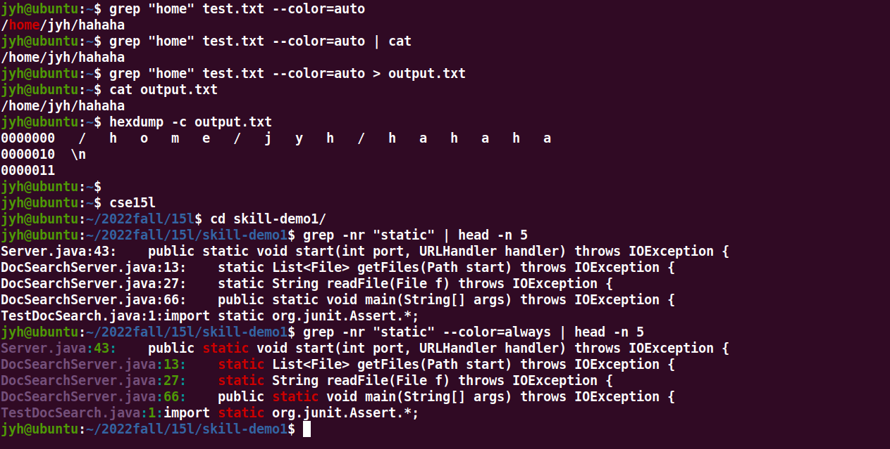

Finally, it is written in munual that the environment variable `GREP_COLORS` is used to set the color of `grep`, which is cool but not really useful.

`export GREP_COLOR='a;b'`

related:  
[https://askubuntu.com/questions/1042234/modifying-the-color-of-grep](https://askubuntu.com/questions/1042234/modifying-the-color-of-grep)

### (b). -n
This is a simple but useful option for displaying line numbers in the result.

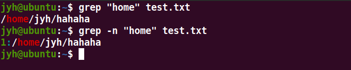

### (c). -R & -r
If you want to recursively search for content in all files, using find and grep:

`find | xargs grep "earth"`

But `grep` itself does it. `-R` recursively search all files in the directory.

>-r, --recursive  
>Read all files under each directory, recursively, following symbolic links only  if  they  are  on  the command  line.   Note  that  if no file operand is given, grep searches the working directory.  This is equivalent to the -d recurse option.

>-R, --dereference-recursive  
>Read all files under each directory, recursively.  Follow all symbolic links, unlike -r.

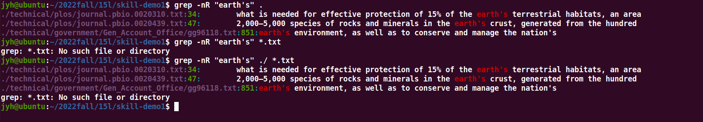

The `-R` in `grep -R *.txt` is meaningless, because it is looking for files and not directories, `grep` ignores this `-R`. That is, if `-R` makes sense, the value of the `FILE` parameter should be a directory.

The `-r` option was modified just 10 years ago, `-r` does not look for symbol links in directories, while `-R` does.

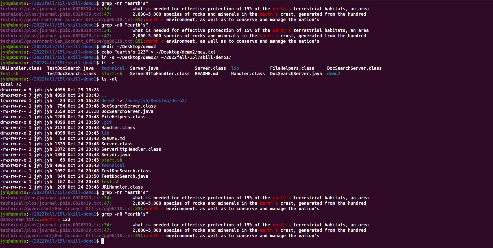

### (d). -B & -C
I want to find the description of `--color` in the manual, and I don't want to read such a long file, I can find it in the manual with `grep`:

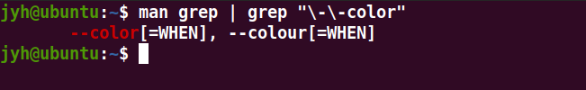

But that's not very informative, since grep will only match that line. The `-C` command means to print out some lines after the match, and `-B` means the previous lines.

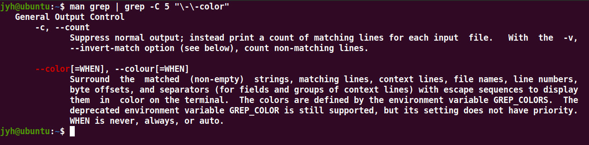

## example
Finally, it is a complex example, find the content containing the word color in the comments of all `c` files of `grep`'s source code, and browse in `less`:

`find . -name "*.c" | xargs grep -zno --color=always '/\*[^*/]*color[^*/]*\*/' | less -R`

It's not perfect, but an interesting example.

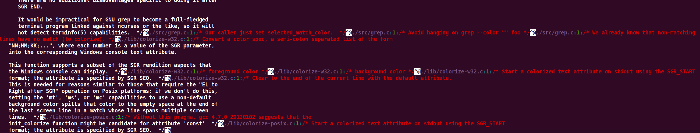

`-z`: treat the input as a whole line (for looking in cross-line comments), but `grep` adds '0' (ASCII 0) to the end of the line, which means `grep` still knows where the end of a line.  
`-o`: Only show matching fields, since everything is a whole line, all input will be output without `-o`.
