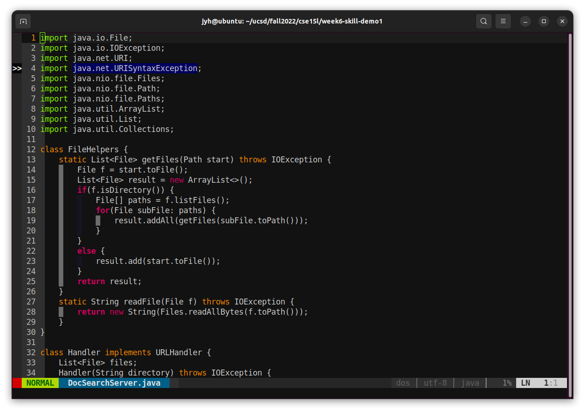
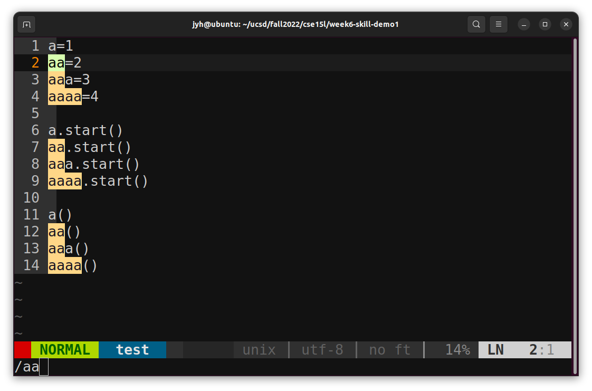
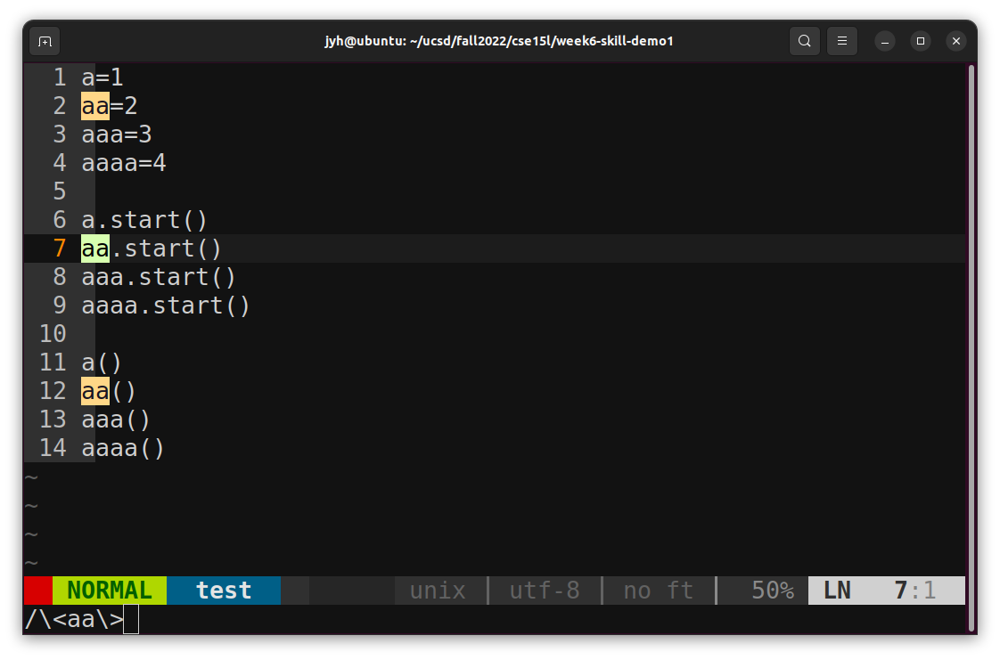

# Lab 4: vim & remote work

## I. Editing in vim
In `DocSearchServer.java`, change the name of the `start` parameter of `getFiles`, and all of its uses, to instead be called `base`.

`:` `1` `2` `,` `3` `0` `s` `/` `\` `<` `s` `t` `a` `r` `t` `\` `>` `/` `b` `a` `s` `e` `/` `g` `I` `<Enter>`
/startENTER>
### (1). Potential problems
1. What we want to modify is the block scoped variable in the `getFiles` method, and direct replacement may modify other methods or global variable.
2. Direct replacement may modify part of the word, such as `int startedNum` will be changed to `int baseedNum`
3. `start` may not be a variable, such as it appears in a comment, in quotes, or as a method name of a class.

### (2). Line number
In order to solve the first problem, we need to limit the scope of replacement. In vim, `[a],[b]s` means to replace between lines `a` and `b`, including `a` `b`.

Then we need to display the line number in vim, we can enter `:set nu` in normal mode, or add set nu to `~/.virmc`. But the former is temporary, it will be invalid after exiting vim.

### (3). Exact match
For the second question, when vim finds and replaces, if the string is enclosed in `\<\>`, it will match the complete word.

Examples:

### (4). gI
`g` means global replacement  
`I` means case sensitive

### (5). summary
`:` `1` `2` `,` `3` `0` `s` `/` `\` `<` `s` `t` `a` `r` `t` `\` `>` `/` `b` `a` `s` `e` `/` `g` `I` `<Enter>`  
Represents that between lines 12 and 30, replace all exact `start` (lowercase) with `base`.

## II. Remote work
In local editing and uploading with scp, I copied the scp command in advance, and it took 34 seconds in total (it took 5 seconds to wait for the ssh connection)  
Modify directly in the remote server, it only took 10 seconds

Writing code on a server without root is torture. The vim in the ieng6 server has no python or python3 support, many plugins cannot be used, and we cannot recompile vim. Writing code on a remote server means that the mouse is completely disabled, and even adjusting the font size requires setting terminal options. If the server is disconnected, we have to restore files from the vim swap...

So before I had to write code on a remote server for the first time, I thought I must write it locally, then upload it with scp or use git.

For this I wrote a bash script that uploads the modified files after the last scp:  
[https://github.com/scripe2022/upload](https://github.com/scripe2022/upload)

Finished writing locally, git push or scp, and then git pull on the server, it sounds good, but my actual experience is terrible.  
After writing and uploading, compile, and then find that a semicolon is missing. Go back to the local, add a semicolon, upload, compile, and then find that a variable name is wrong. Go back to the local...  
If you don't hold back and change the code directly on the server, then the real disaster begins. You have to keep in mind whether the last change was on the server or locally, git add, git commit, git push there, and then git pull on another.

So my experience is, write locally and upload, or write directly on the server, don't mix the two. If I had to choose one of the two, I'd rather write directly on the server, it's ridiculous to wait 10 seconds after just change a letter.

If the project can be compiled, run and debugged locally, then I will choose to write the code locally, and then upload it to the server for testing after completing each part.  
If the project contains binaries that cannot be linked locally and cannot be compiled, run and debugged, then I will go directly to the server.
