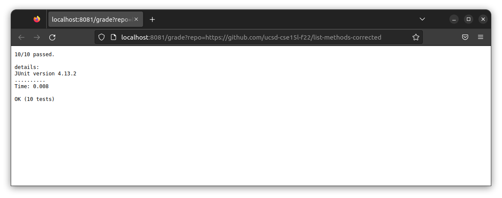
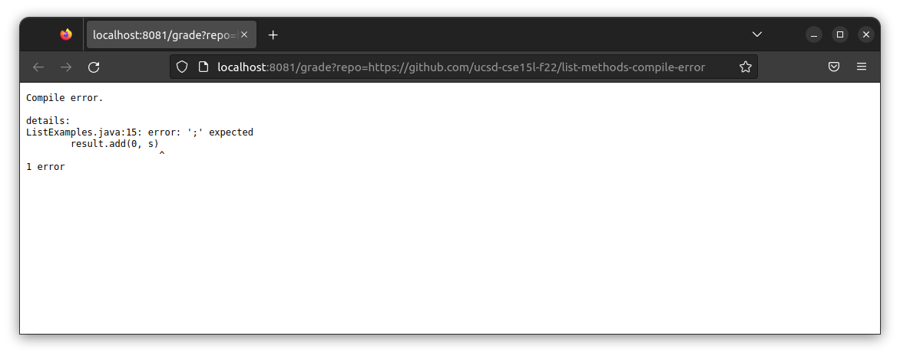
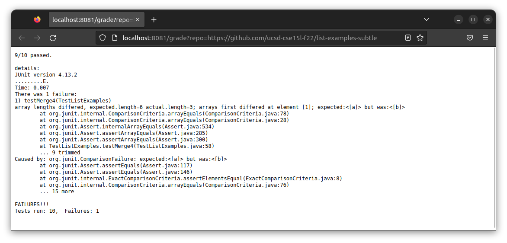

# Lab 5: Auto grade

[https://github.com/scripe2022/list-examples-grader/tree/main](https://github.com/scripe2022/list-examples-grader/tree/main)

## grade.sh
```bash
#!/bin/bash

CPATH=".:../lib/hamcrest-core-1.3.jar:../lib/junit-4.13.2.jar"
DIR="submission"
TESTJAVA="TestListExamples.java"
TESTOBJ="${TESTJAVA%.*}"
FILENAME="ListExamples.java"
# redirect std error
COMPILEINFO=".compile.error"
TESTINFO=".unittest.error"
GITINFO=".git.error"

# git clone
if [[ -d $DIR ]]; then
    rm -rf $DIR
fi
git clone $1 $DIR > /dev/null 2>$GITINFO
if [[ $? -ne 0 ]]; then
    cat $GITINFO
    rm $GITINFO
    exit 3
fi
rm $GITINFO
# file exist
cp $TESTJAVA $DIR/
cd $DIR
if [[ ! -f $FILENAME ]]; then
    echo "$FILENAME not found"
    exit 2
fi
# compile
javac -cp $CPATH *.java 2> $COMPILEINFO
if [[ $? -ne 0 ]]; then
    echo -e "Compile error."
    echo -e "\ndetails:"
    cat $COMPILEINFO
    exit 1
fi
# run
java -cp $CPATH org.junit.runner.JUnitCore $TESTOBJ > $TESTINFO
# result
result=`grep '^[\.E]\+$' < .unittest.error`
error=`grep -o 'E' <<<"$result" | grep -c .`
total=`grep -o '\.' <<<"$result" | grep -c .`
echo "$((total-error))/$total passed."
echo -e "\ndetails:"
cat $TESTINFO
```

## Examples
  
  


## Trace
https://github.com/ucsd-cse15l-f22/list-examples-subtle

### 1. shebang & constant
```bash
#!/bin/bash

CPATH=".:../lib/hamcrest-core-1.3.jar:../lib/junit-4.13.2.jar"
DIR="submission"
TESTJAVA="TestListExamples.java"
TESTOBJ="${TESTJAVA%.*}"
FILENAME="ListExamples.java"
# redirect std error
COMPILEINFO=".compile.error"
TESTINFO=".unittest.error"
GITINFO=".git.error"
```

### 2. remove directory
```bash
if [[ -d $DIR ]]; then
    rm -rf $DIR
fi
```
If the directory $DIR(submission) exists, delete this directory

### 3. git clone
```bash
git clone $1 $DIR > /dev/null 2> $GITINFO
```
standard output: (empty)
```bash
```
standard error:
```bash
Cloning into 'submission'...
```
exit code:
```
0
```

### 4. clone successful?
```bash
if [[ $? -ne 0 ]]; then
    cat $GITINFO
    rm $GITINFO
    exit 3
fi
rm $GITINFO
```
If the git clone is not successful, that is, the exit code is not 0, then output standard error and exit the bash script.  
For this example, git clone is successful, the exit code is 0, and the statements in the if branch are not executed, then delete the standard error file.

### 5. copy files and change directory
```bash
cp $TESTJAVA $DIR/
cd $DIR
if [[ ! -f $FILENAME ]]; then
    echo "$FILENAME not found"
    exit 2
fi
```
Copy the unit test file into the directory, and enter the directory. If the file to be tested does not exist, the output file does not exist and exit the bash script.  
In this example the file exists.

### 6. compile
```bash
javac -cp $CPATH *.java 2> $COMPILEINFO
```
standard output: (empty)
```bash
```
standard error: (empty)
```bash
```
exit code:
```
0
```
Compile the java file and redirect the standard error to the file.  
In this example the compilation succeeds, both stdout and stderr are empty

### 7. compile successful?
```bash
if [[ $? -ne 0 ]]; then
    echo -e "Compile error."
    echo -e "\ndetails:"
    cat $COMPILEINFO
    exit 1
fi
```
If the exit code is not 0, that is, has a compilation error, the standard error during the compilation process is output.  
Compilation succeeds in this example.

### 8. run
```bash
java -cp $CPATH org.junit.runner.JUnitCore $TESTOBJ > $TESTINFO
```
Run the java file and redirect the standard output to the file.  

standard output:
```bash
JUnit version 4.13.2
.........E.
Time: 0.008
There was 1 failure:
1) testMerge4(TestListExamples)
array lengths differed, expected.length=6 actual.length=3; arrays first differed at element [1]; expected:<[a]> but was:<[b]>
	at org.junit.internal.ComparisonCriteria.arrayEquals(ComparisonCriteria.java:78)
	at org.junit.internal.ComparisonCriteria.arrayEquals(ComparisonCriteria.java:28)
	at org.junit.Assert.internalArrayEquals(Assert.java:534)
	at org.junit.Assert.assertArrayEquals(Assert.java:285)
	at org.junit.Assert.assertArrayEquals(Assert.java:300)
	at TestListExamples.testMerge4(TestListExamples.java:58)
	... 9 trimmed
Caused by: org.junit.ComparisonFailure: expected:<[a]> but was:<[b]>
	at org.junit.Assert.assertEquals(Assert.java:117)
	at org.junit.Assert.assertEquals(Assert.java:146)
	at org.junit.internal.ExactComparisonCriteria.assertElementsEqual(ExactComparisonCriteria.java:8)
	at org.junit.internal.ComparisonCriteria.arrayEquals(ComparisonCriteria.java:76)
	... 15 more

FAILURES!!!
Tests run: 10,  Failures: 1
```
standard error: (empty)
```bash
```
exit code:
```
0
```

### 9. summary
```bash
result=`grep '^[\.E]\+$' < .unittest.error`
error=`grep -o 'E' <<<"$result" | grep -c .`
total=`grep -o '\.' <<<"$result" | grep -c .`
echo "$((total-error))/$total passed."
echo -e "\ndetails:"
cat $TESTINFO
```
Use grep and regular expressions to get the number of unit tests and the number of errors.  
Output a summary, Passed/Total.  
Then print the standard output of the unit test.

output:
```bash
9/10 passed.

details:
JUnit version 4.13.2
.........E.
Time: 0.008
There was 1 failure:
1) testMerge4(TestListExamples)
array lengths differed, expected.length=6 actual.length=3; arrays first differed at element [1]; expected:<[a]> but was:<[b]>
	at org.junit.internal.ComparisonCriteria.arrayEquals(ComparisonCriteria.java:78)
	at org.junit.internal.ComparisonCriteria.arrayEquals(ComparisonCriteria.java:28)
	at org.junit.Assert.internalArrayEquals(Assert.java:534)
	at org.junit.Assert.assertArrayEquals(Assert.java:285)
	at org.junit.Assert.assertArrayEquals(Assert.java:300)
	at TestListExamples.testMerge4(TestListExamples.java:58)
	... 9 trimmed
Caused by: org.junit.ComparisonFailure: expected:<[a]> but was:<[b]>
	at org.junit.Assert.assertEquals(Assert.java:117)
	at org.junit.Assert.assertEquals(Assert.java:146)
	at org.junit.internal.ExactComparisonCriteria.assertElementsEqual(ExactComparisonCriteria.java:8)
	at org.junit.internal.ComparisonCriteria.arrayEquals(ComparisonCriteria.java:76)
	... 15 more

FAILURES!!!
Tests run: 10,  Failures: 1
```